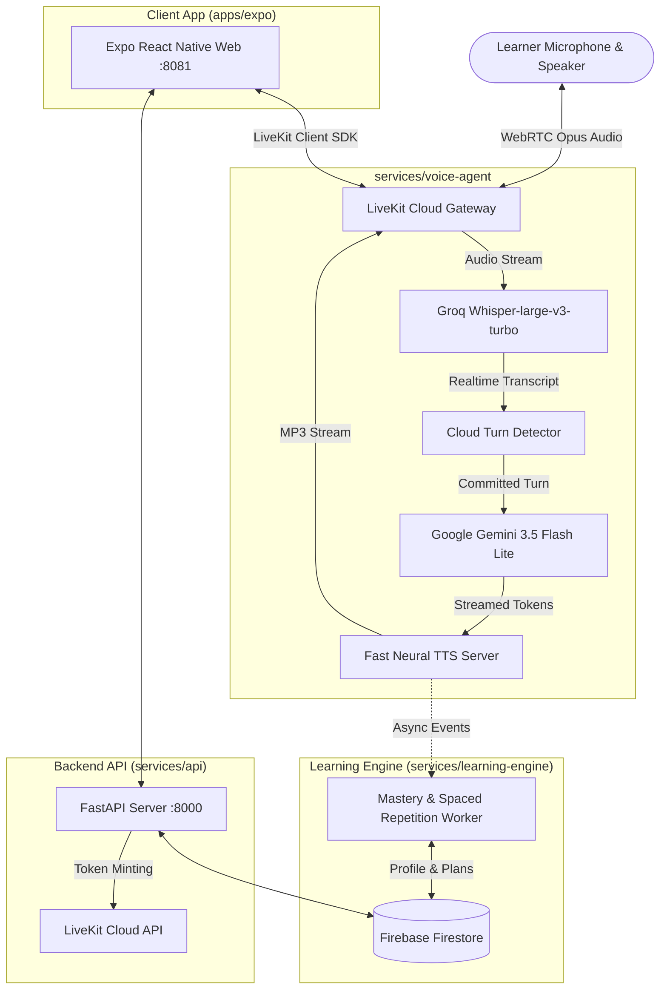

# Pravaah (प्रवाह) — Real-Time Conversational AI Spoken English Coach

[](https://www.python.org/)
[](https://expo.dev/)
[](https://fastapi.tiangolo.com/)
[](https://livekit.io/)
[](https://groq.com/)
[](https://deepmind.google/technologies/gemini/)
[](LICENSE)

**Pravaah (प्रवाह)** is an end-to-end, ultra-low-latency AI voice coach designed specifically for **Hindi-speaking English learners**. It provides natural, full-duplex spoken conversations, live pronunciation & grammar corrections explained in **Hinglish**, diagnostic CEFR assessments, and adaptive daily practice plans.

---

## 🌟 Key Features

- **⚡ Sub-1.5s Voice Turnaround:** Pipelined streaming pipeline combining **Groq Whisper Turbo (STT)**, **Google Gemini 3.5 Flash Lite (LLM)**, and **Microsoft Neural / Kokoro (TTS)** over WebRTC.
- **🎙️ Authentic Indian Voice & Hinglish Grammar Rules:** Speaks in a natural Indian accent (`en-IN-NeerjaNeural`) and explains grammatical mistakes in simple Hinglish (*"Kyunki past tense mein verb ka second form use hota hai"*).
- **🛑 Real-Time Barge-in & Interruption:** Full-duplex audio with smart Cloud Turn Detection (`min_endpointing_delay: 300ms`) and speculative LLM generation. Talk over the AI naturally at any time.
- **📊 Diagnostic Spoken Assessment:** 4-question adaptive oral assessment scoring learners on Fluency, Pronunciation, Grammar, and Vocabulary (CEFR A1 to C2).
- **📈 Longitudinal Mastery Engine:** Asynchronous learning engine tracks grammar errors, phoneme mistakes, and vocabulary growth across sessions using Firestore outbox persistence.
- **📱 Cross-Platform UI (PWA & Mobile):** Responsive, dark-mode native and web application built with **Expo & React Native Web**, featuring interactive waveform visualization and session transcripts.

---

## 🏗️ System Architecture



---

## 📁 Repository Structure

```text
pravaah/
├── apps/
│   └── expo/                  # Frontend (React Native Web / Expo PWA)
│       ├── app/               # Expo Router screens (Dashboard, Practice, Assessment, Progress)
│       ├── components/        # Voice visualizer, audio recorder, session cards
│       ├── lib/               # Firebase Client & LiveKit WebRTC client integration
│       └── package.json       # Frontend dependencies
├── services/
│   ├── api/                   # FastAPI Backend API (Port 8000)
│   │   ├── app/main.py        # Token generation, session endpoints, user profile APIs
│   │   └── requirements.txt
│   ├── voice-agent/           # Realtime Voice Pipeline (LiveKit Worker)
│   │   ├── agent.py           # Core EnglishTutor logic, system prompt & turn detector
│   │   ├── kokoro_server.py   # Fast Neural TTS server (Port 8880)
│   │   └── requirements.txt
│   └── learning-engine/       # Curriculum & Longitudinal Mastery Worker
│       ├── curriculum.py      # 4-stage CEFR syllabus & practice activities
│       ├── worker.py          # Session analyzer, grammar mastery & daily plan generator
│       └── requirements.txt
├── firebase/
│   ├── firestore.rules        # Security rules
│   └── firestore.indexes.json # Composite indexes
├── tests/                     # Comprehensive test suite (Unit, E2E, Benchmarks)
├── start.bat                  # 1-Click Windows Batch launcher (launches all 4 services)
├── start.ps1                  # 1-Click PowerShell launcher
├── .env.example               # Template environment configuration
└── README.md
```

---

## ⚙️ Prerequisites

Before setting up Pravaah on a new device, ensure you have installed:

1. **[Git](https://git-scm.com/)**
2. **[Node.js (v18.x or v20.x)](https://nodejs.org/)** and `npm`
3. **[Python (3.11 or 3.12)](https://www.python.org/)**
4. Free API accounts for:
   - **[Firebase Console](https://console.firebase.google.com/)** (Authentication & Firestore Database)
   - **[LiveKit Cloud](https://cloud.livekit.io/)** (Free tier WebRTC project)
   - **[Google AI Studio](https://aistudio.google.com/)** (Gemini API Key)
   - **[Groq Cloud](https://console.groq.com/)** (Groq Whisper STT API Key)

---

## 🚀 Quickstart: Setup on a New Device

### 1. Clone the Repository

```bash
git clone https://github.com/tanmay316/Pravaah.git
cd Pravaah
```

---

### 2. Set Up Python Virtual Environment

```bash
# Windows
python -m venv .venv
.venv\Scripts\activate

# macOS / Linux
python3 -m venv .venv
source .venv/bin/activate
```

---

### 3. Install Backend & Voice Agent Dependencies

```bash
# Upgrade pip
python -m pip install --upgrade pip

# Install dependencies for all backend services
pip install -r services/api/requirements.txt
pip install -r services/learning-engine/requirements.txt
pip install -r services/voice-agent/requirements.txt
pip install edge-tts
```

---

### 4. Install Frontend (Expo) Dependencies

```bash
cd apps/expo
npm install
cd ../..
```

---

### 5. Configure Environment Variables

1. Copy `.env.example` to `.env`:
   ```bash
   cp .env.example .env
   ```
2. Also copy `.env` into each sub-service folder:
   ```bash
   cp .env services/api/.env
   cp .env services/learning-engine/.env
   cp .env services/voice-agent/.env
   cp .env apps/expo/.env
   ```
3. Open `.env` and fill in your actual credentials:
   ```ini
   # --- Expo Frontend Keys ---
   EXPO_PUBLIC_FIREBASE_API_KEY=your-firebase-web-api-key
   EXPO_PUBLIC_FIREBASE_AUTH_DOMAIN=your-project.firebaseapp.com
   EXPO_PUBLIC_FIREBASE_PROJECT_ID=your-project-id
   EXPO_PUBLIC_FIREBASE_APP_ID=1:123456789:web:abcdef
   EXPO_PUBLIC_FIREBASE_STORAGE_BUCKET=your-project.firebasestorage.app
   EXPO_PUBLIC_FIREBASE_MESSAGING_SENDER_ID=your-sender-id
   EXPO_PUBLIC_API_URL=http://localhost:8000

   # --- Firebase Admin Service Account ---
   FIREBASE_SERVICE_ACCOUNT_PATH=../../secrets/firebase-service-account.json

   # --- LiveKit WebRTC ---
   LIVEKIT_URL=wss://your-subdomain.livekit.cloud
   LIVEKIT_API_KEY=your-livekit-api-key
   LIVEKIT_API_SECRET=your-livekit-api-secret

   # --- LLM & STT ---
   GEMINI_API_KEY=your-gemini-api-key
   GROQ_API_KEY=your-groq-api-key

   # --- TTS ---
   TTS_PROVIDER=kokoro
   KOKORO_BASE_URL=http://localhost:8880/v1
   KOKORO_VOICE=en-IN-NeerjaNeural
   ```

4. **Firebase Service Account:**
   - In Firebase Console, go to **Project Settings** > **Service Accounts** > **Generate new private key**.
   - Save the downloaded JSON file as `secrets/firebase-service-account.json` in your project root.

---

### 6. Launch All Services

#### Option A: One-Click Launcher (Windows)
Double-click `start.bat` or run:
```powershell
.\start.ps1
```

#### Option B: Manual Multi-Terminal Launch (Any OS)

Open 4 terminal windows and run:

**Terminal 1 — Fast Neural TTS Server (Port 8880):**
```bash
cd services/voice-agent
python kokoro_server.py
```

**Terminal 2 — FastAPI Backend (Port 8000):**
```bash
cd services/api
python -m uvicorn app.main:app --port 8000 --reload
```

**Terminal 3 — LiveKit Cloud Voice Agent Worker:**
```bash
cd services/voice-agent
python agent.py dev
```

**Terminal 4 — Expo Web Frontend (Port 8081):**
```bash
cd apps/expo
npx expo start --web
```

---

## 🌐 Endpoints & Ports Reference

| Service | Port / URL | Description |
| :--- | :--- | :--- |
| **Expo Web App** | `http://localhost:8081` | Interactive learner web client |
| **FastAPI Backend** | `http://localhost:8000` | REST API (LiveKit tokens, history, profiles) |
| **Swagger API Docs** | `http://localhost:8000/docs` | Interactive OpenAPI documentation |
| **Neural TTS Server** | `http://localhost:8880/v1` | OpenAI-compatible TTS audio synthesizer |
| **Voice Agent Worker** | `wss://<project>.livekit.cloud` | Realtime LiveKit WebRTC worker |

---

## 🧪 Testing

Run the automated test suite to verify all endpoints, latency benchmarks, and curriculum logic:

```bash
# Run all unit and integration tests
pytest tests/ -v

# Run targeted voice latency benchmarks
python tests/controlled_latency_benchmark.py
```

---

## 🛠️ Troubleshooting & FAQs

### 1. "404 Not Found on Gemini Model"
Ensure you are using `gemini-3.5-flash-lite` or `gemini-2.5-flash` in your `GEMINI_API_KEY` configuration.

### 2. "TTS / Google Cloud 503 Auth Error"
Google Cloud Speech gRPC credentials are not required. Ensure `agent.py` points to `http://localhost:8880/v1` (`kokoro_server.py`), which uses free, high-speed neural TTS (`en-IN-NeerjaNeural`).

### 3. "Port 8880 or 8000 is already in use"
On Windows:
```powershell
netstat -ano | findstr :8880
taskkill /F /PID <PID_NUMBER>
```

### 4. Microphone Permissions in Browser
Ensure your browser allows microphone permissions on `http://localhost:8081`. For local testing, Chrome/Edge treats `localhost` as a secure context.

---

## 📄 License

This project is licensed under the [MIT License](LICENSE).
